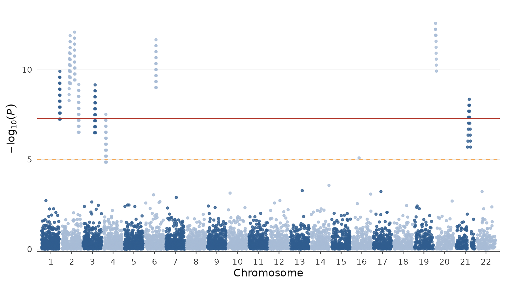
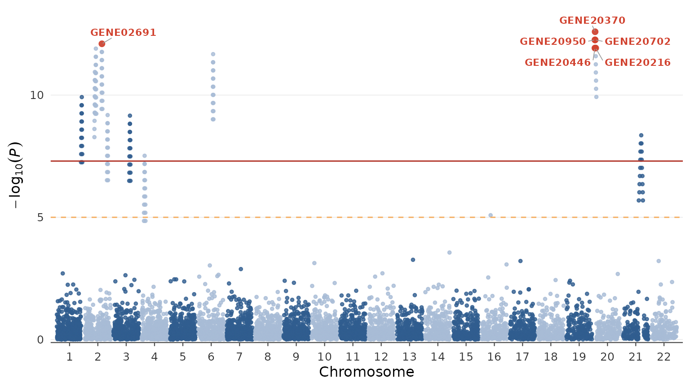
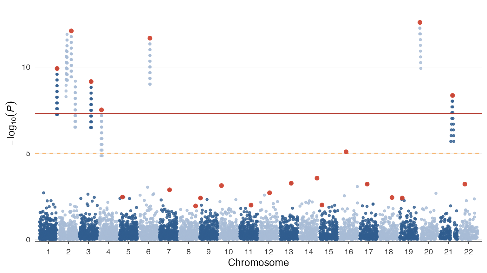
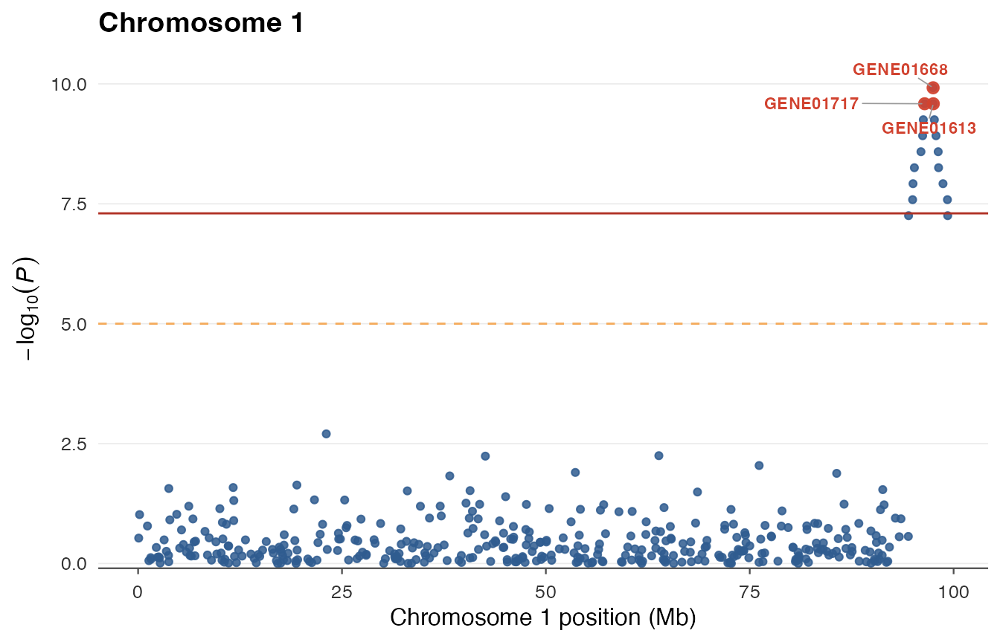
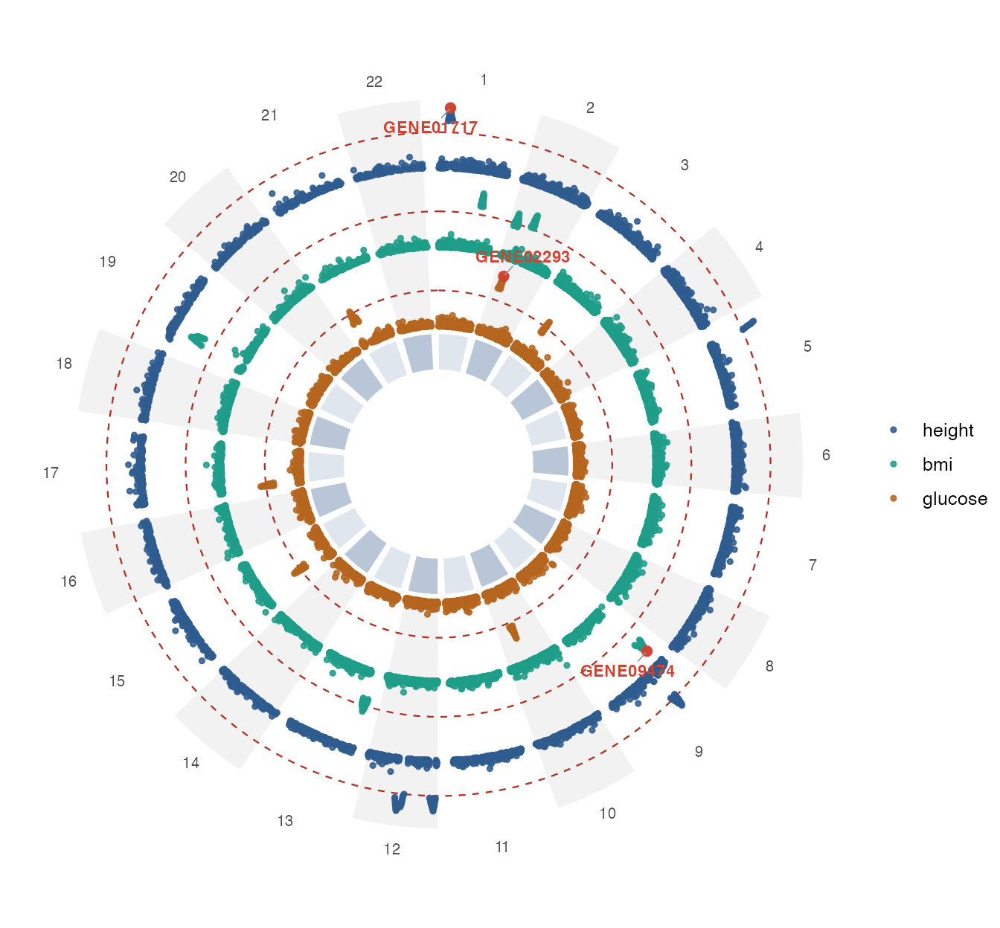
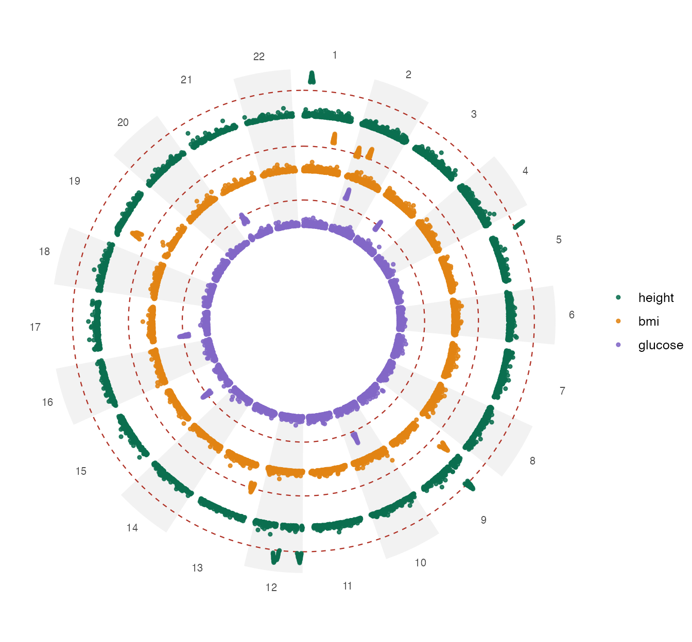
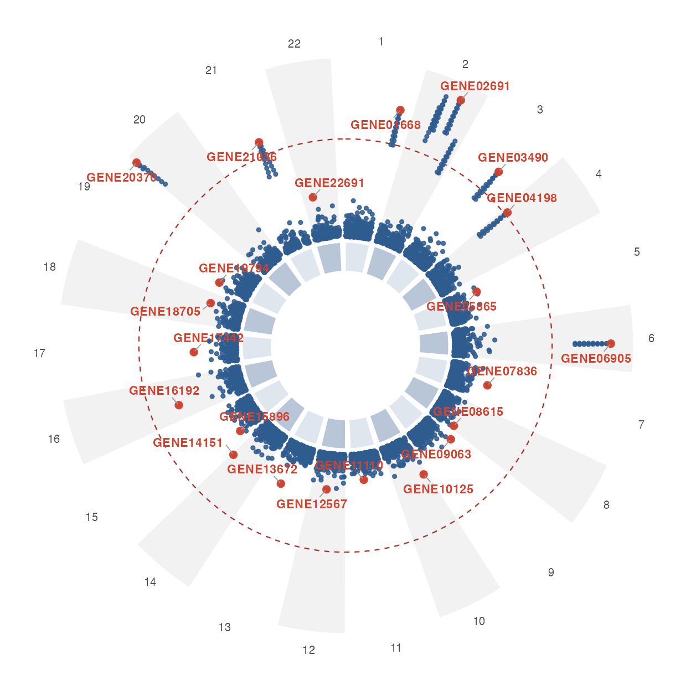

# Getting started with gwasplot

``` r

library(gwasplot)
```

**gwasplot** turns a tidy table of GWAS summary statistics into
publication-ready and interactive figures. This vignette walks through
the data contract, the three plot types, top-marker highlighting,
interactivity, and the top-hits table.

## The data contract

Every function expects the four canonical columns `SNP`, `CHR`, `POS`
and `P` (plus optional `gene` and `trait`). You rarely have to prepare
them by hand —
[`validate_gwas()`](https://loukesio.github.io/gwasplot/reference/validate_gwas.md)
auto-detects common column-name aliases and coerces types:

``` r

raw <- data.frame(
  marker = c("rs1", "rs2", "rs3"),
  chrom  = c(1, 1, 2),
  bp     = c(100, 200, 150),
  pvalue = c(1e-8, 0.2, 3e-3)
)
validate_gwas(raw)
#> # A tibble: 3 × 4
#>   SNP   CHR     POS          P
#>   <chr> <fct> <dbl>      <dbl>
#> 1 rs1   1       100 0.00000001
#> 2 rs2   1       200 0.2       
#> 3 rs3   2       150 0.003
```

All the plotting functions call
[`validate_gwas()`](https://loukesio.github.io/gwasplot/reference/validate_gwas.md)
internally, so you can pass raw data directly. Two simulated datasets
ship with the package:

``` r

data(gwas_example)  # single trait, 22 chromosomes
data(gwas_multi)    # three traits: height, bmi, glucose
gwas_example
#> # A tibble: 5,940 × 5
#>    SNP   CHR       POS      P gene     
#>    <chr> <fct>   <dbl>  <dbl> <chr>    
#>  1 rs1   1       74399 0.295  GENE01399
#>  2 rs2   1      180831 0.0955 GENE01831
#>  3 rs3   1     1147122 0.165  GENE01122
#>  4 rs4   1     1321963 0.870  GENE01963
#>  5 rs5   1     1547422 0.753  GENE01422
#>  6 rs6   1     1574771 0.815  GENE01771
#>  7 rs7   1     2234627 0.462  GENE01627
#>  8 rs8   1     2374338 0.740  GENE01338
#>  9 rs9   1     2533357 0.726  GENE01357
#> 10 rs10  1     2628801 0.765  GENE01801
#> # ℹ 5,930 more rows
```

## Manhattan plot

``` r

gwas_manhattan(gwas_example)
```



Chromosomes are laid end-to-end with alternating colour bands; the solid
line is the genome-wide threshold (`5e-8`) and the dashed line is the
suggestive threshold (`1e-5`).

## Highlighting top markers

[`highlight_top()`](https://loukesio.github.io/gwasplot/reference/highlight_top.md)
bundles a selection rule that is shared by every plot *and* the table,
so a figure and its table always agree. Combine any of `top_n`,
`threshold`, `snps`, `genes`, and `by`:

``` r

gwas_manhattan(gwas_example, highlight = highlight_top(top_n = 6))
```



`by` groups before taking `top_n` — for example, the lead SNP on every
chromosome:

``` r

gwas_manhattan(gwas_example, highlight = highlight_top(top_n = 1, by = "CHR"),
               label = FALSE)
```



## Zooming into one chromosome

``` r

gwas_chromosome(gwas_example, chr = 1, highlight = highlight_top(top_n = 3))
```



## Circular plots with multiple rings

[`gwas_circular()`](https://loukesio.github.io/gwasplot/reference/gwas_circular.md)
arranges the chromosomes once around a circle and draws each trait as
its own concentric ring (outermost = first trait). This is the
CMplot-style view.

``` r

gwas_circular(gwas_multi, highlight = highlight_top(top_n = 1, by = "trait"))
```



Useful options:

- `shared_scale = FALSE` scales each ring to its own maximum (peaks fill
  the ring) instead of a common scale.
- `ideogram = FALSE` drops the central chromosome band.
- `colors` sets one colour per ring.

``` r

gwas_circular(gwas_multi, shared_scale = FALSE, ideogram = FALSE,
              colors = c("#0b6e4f", "#e28413", "#8367c7"))
```



A single-trait frame collapses to one ring automatically:

``` r

gwas_circular(gwas_example, highlight = highlight_top(top_n = 1, by = "CHR"))
```



> **Tip.** When you highlight many markers (e.g. every genome-wide hit
> via a `threshold`), set `label = FALSE` to avoid a wall of overlapping
> labels.

## Interactive plots

Pass `interactive = TRUE` to any of the three plots to turn it into a
[ggiraph](https://davidgohel.github.io/ggiraph/) htmlwidget. Every point
then carries a hover tooltip with its **SNP, gene, chromosome, position
and p-value**; you can also **scroll to zoom** and **drag to pan**, and
hovering highlights the point. This works in HTML output such as this
vignette, an R Markdown / Quarto report, or a Shiny app.

### Interactive Manhattan

Hover any peak to read off the exact marker behind it — no need to
squint at labels or cross-reference a table. Because an interactive plot
turns every point into an SVG node, we first **thin** the data: keep all
the interesting hits plus a small random sample of the null background.
This keeps the widget snappy while leaving every peak intact.

``` r

set.seed(1)
keep <- gwas_example$P < 1e-3 | runif(nrow(gwas_example)) < 0.15
gwas_manhattan(gwas_example[keep, ], highlight = highlight_top(top_n = 6),
               interactive = TRUE)
```

### Interactive circular

The tooltips are per ring, so a hovered point also tells you **which
trait** it belongs to. Here we use a small simulated dataset so the
widget stays light — interactive SVGs grow with the number of points, so
prefer to thin very dense data first (see the note below).

``` r

demo <- simulate_gwas(n_chr = 12, snps_per_chr = 120,
                      traits = c("trait A", "trait B"), seed = 11)
gwas_circular(demo, highlight = highlight_top(top_n = 1, by = "trait"),
              interactive = TRUE)
```

### Interactive single chromosome

Zooming into a region and hovering is a quick way to inspect a locus:

``` r

gwas_chromosome(gwas_example, chr = 1, highlight = highlight_top(top_n = 3),
                interactive = TRUE)
```

> **Keeping widgets fast.** Each point becomes an SVG node, so a
> genome-wide interactive plot of millions of SNPs can be slow or crash
> the browser. For large studies, either draw a static plot, or thin the
> non-significant points before making the plot interactive — for
> example keep every hit with `P < 0.01` plus a random 5% of the rest. A
> dedicated down-sampling helper for very large GWAS is on the roadmap.

## Top-markers table

[`gwas_top()`](https://loukesio.github.io/gwasplot/reference/gwas_top.md)
returns the selected markers as a plain tibble, and
[`gwas_table()`](https://loukesio.github.io/gwasplot/reference/gwas_table.md)
formats them as a [gt](https://gt.rstudio.com) table — positions with
thousands separators, p-values in scientific notation, and a
colour-scaled $`-\log_{10}(P)`$ column.

``` r

gwas_top(gwas_example, highlight = highlight_top(top_n = 5))
#> # A tibble: 5 × 6
#>   SNP    gene      CHR        POS        P neg_log10_p
#>   <chr>  <chr>     <fct>    <dbl>    <dbl>       <dbl>
#> 1 rs5486 GENE20370 20     1342370 2.55e-13        12.6
#> 2 rs5485 GENE20950 20      651950 5.50e-13        12.3
#> 3 rs5487 GENE20702 20     1501702 5.50e-13        12.3
#> 4 rs646  GENE02691 2     65881691 7.94e-13        12.1
#> 5 rs5484 GENE20446 20      535446 1.18e-12        11.9
```

``` r

gwas_table(gwas_example, highlight = highlight_top(top_n = 8),
           title = "Top GWAS hits")
```

| Top GWAS hits |           |     |            |              |           |
|---------------|-----------|-----|------------|--------------|-----------|
| SNP           | Gene      | Chr | Position   | P-value      | −log₁₀(P) |
| rs5486        | GENE20370 | 20  | 1,342,370  | 2.55 × 10⁻¹³ | 12.6      |
| rs5485        | GENE20950 | 20  | 651,950    | 5.50 × 10⁻¹³ | 12.3      |
| rs5487        | GENE20702 | 20  | 1,501,702  | 5.50 × 10⁻¹³ | 12.3      |
| rs646         | GENE02691 | 2   | 65,881,691 | 7.94 × 10⁻¹³ | 12.1      |
| rs5484        | GENE20446 | 20  | 535,446    | 1.18 × 10⁻¹² | 11.9      |
| rs5488        | GENE20216 | 20  | 3,639,216  | 1.18 × 10⁻¹² | 11.9      |
| rs563         | GENE02324 | 2   | 42,260,324 | 1.25 × 10⁻¹² | 11.9      |
| rs645         | GENE02251 | 2   | 65,374,251 | 1.71 × 10⁻¹² | 11.8      |

Because the table and the plot share
[`highlight_top()`](https://loukesio.github.io/gwasplot/reference/highlight_top.md),
you can highlight the same markers in both:

``` r

hl <- highlight_top(top_n = 8)
gwas_manhattan(gwas_example, highlight = hl)   # figure
gwas_table(gwas_example, highlight = hl)        # matching table
```
